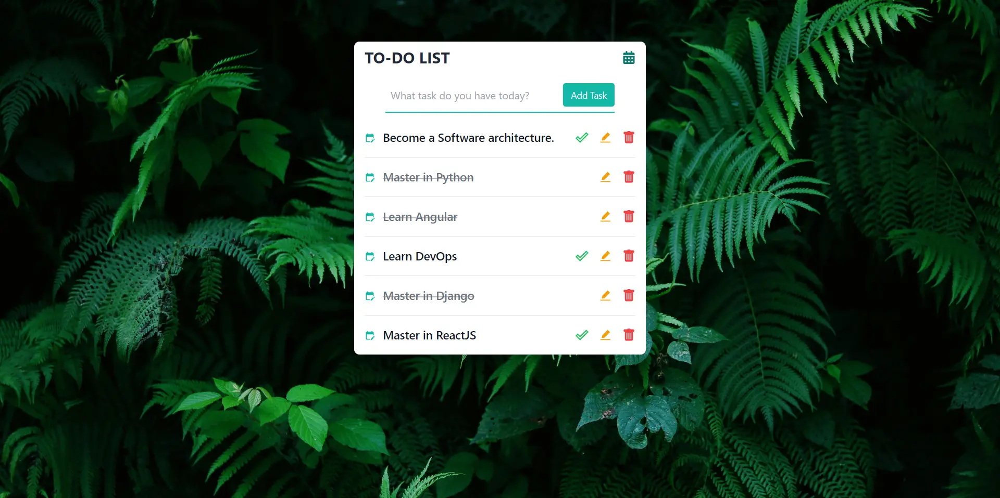

# ToDo App


## [React](https://reactjs.org/) + [Vite](https://vitejs.dev/) + [Firebase](https://firebase.google.com/) + [Tailwind CSS](https://tailwindcss.com/) + [React Icons](https://react-icons.github.io/react-icons/)

A simple Todo App built with React, Vite, Tailwind CSS, React Icons, and Firebase.

> **Note:** You need to switch to the `firebase` branch to see the code that includes Firebase integration. The `master` branch contains the code for the Todo application without Firebase.

## Git Branches

- **`master`**: Contains the version of the app without Firebase integration.
- **`firebase`**: Contains the version of the app with Firebase Firestore for real-time database updates.

## Features

- Add, edit, and delete todos
- Mark todos as complete
- Real-time database updates with Firebase Firestore (in the `firebase` branch)

## Screenshot



## Getting Started

### Prerequisites

Make sure you have Node.js and npm installed on your machine.

### Installation

1. Clone the repository:

```bash
git clone https://github.com/sravan-kumar-ta/React-Todo.git
```

2. Navigate to the project directory:

```bash
cd todo-app
```

3. Install the dependencies:

```bash
npm install
```

## Firebase Configuration

1. Go to the [Firebase Console](https://console.firebase.google.com/) and create a new project.
2. Add a web app to your Firebase project.
3. Copy the Firebase config object from the Firebase Console and paste it into a new file called firebaseConfig.js in the src directory.

```bash
// src/firebaseConfig.js

const firebaseConfig = {
  apiKey: "YOUR_API_KEY",
  authDomain: "YOUR_AUTH_DOMAIN",
  projectId: "YOUR_PROJECT_ID",
  storageBucket: "YOUR_STORAGE_BUCKET",
  messagingSenderId: "YOUR_MESSAGING_SENDER_ID",
  appId: "YOUR_APP_ID"
};

export default firebaseConfig;

```

4. Initialize Firebase in your app:

```bash
// src/firebase.js

import { initializeApp } from "firebase/app";
import { getFirestore } from "firebase/firestore";

const firebaseConfig = {
  apiKey: import.meta.env.VITE_FIREBASE_API_KEY,
  authDomain: import.meta.env.VITE_FIREBASE_AUTH_DOMAIN,
  projectId: import.meta.env.VITE_FIREBASE_PROJECT_ID,
  storageBucket: import.meta.env.VITE_FIREBASE_STORAGE_BUCKET,
  messagingSenderId: import.meta.env.VITE_FIREBASE_MESSAGING_SENDER_ID,
  appId: import.meta.env.VITE_FIREBASE_APP_ID,
};

// Initialize Firebase
const app = initializeApp(firebaseConfig);
export getFirestore(app);
```

### Running the App

1. Start the development server:

```bash
npm run dev
```

2. Open your browser and navigate to http://localhost:3000.

> Note: The default port number for Vite has been changed from 5173 to 3000.

## React + Vite

This template provides a minimal setup to get React working in Vite with HMR and some ESLint rules.

Currently, two official plugins are available:

- [@vitejs/plugin-react](https://github.com/vitejs/vite-plugin-react/blob/main/packages/plugin-react/README.md) uses [Babel](https://babeljs.io/) for Fast Refresh
- [@vitejs/plugin-react-swc](https://github.com/vitejs/vite-plugin-react-swc) uses [SWC](https://swc.rs/) for Fast Refresh

## Contributing

Contributions are welcome! Please feel free to submit a Pull Request.

---
